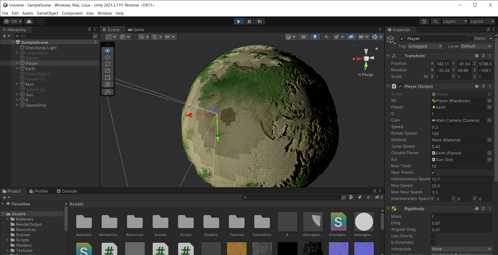
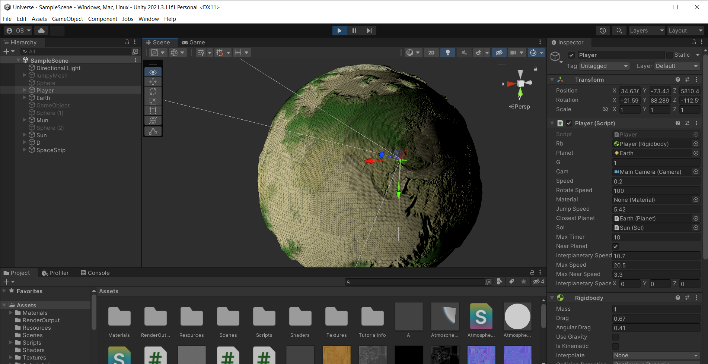
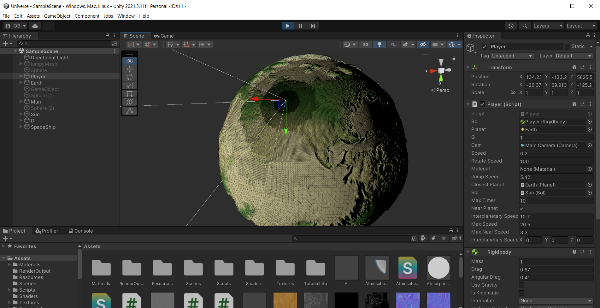
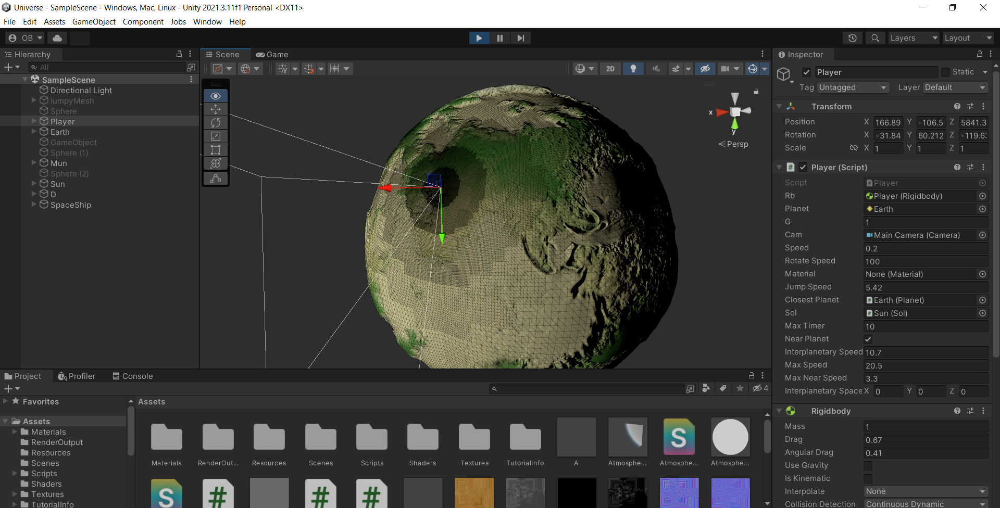
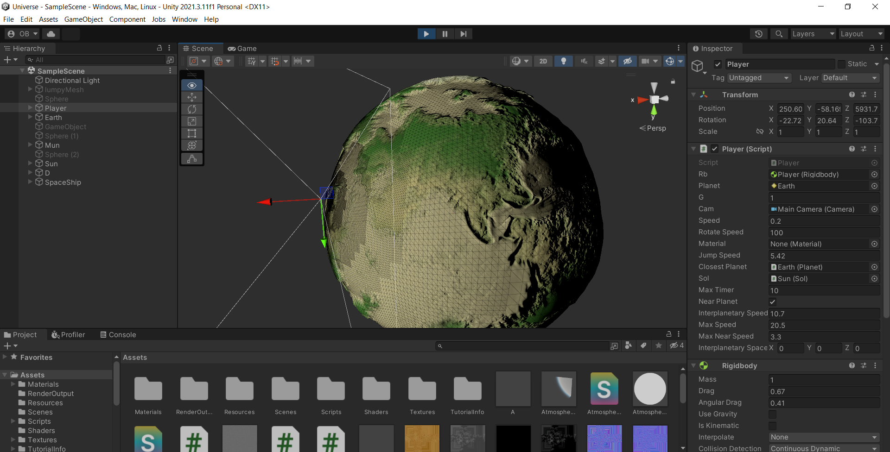

# Level-of-Detail-Planetary-Terrain-Generation
Seamless parallel dynamic planetary terrain generation on runtime using cubemap heightmap texture for Unity with Unity Jobs System

 with unity jobs system generation is parallelized
 I provide an example cubemap
 only red channed needed for heightmap
 customizable resolution and distance parameters
 no garbage produced
 I used fixed sixe arrays so vertice fixed size should change accordingly to the resolution

### Screenshots

